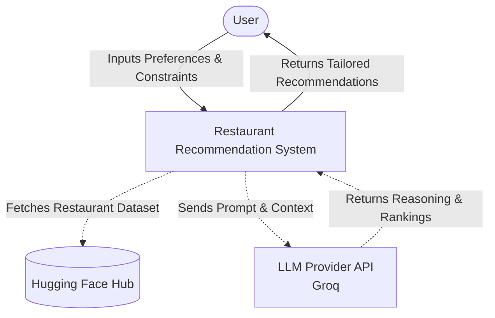
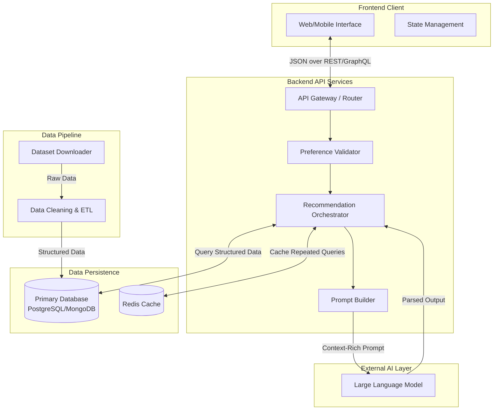
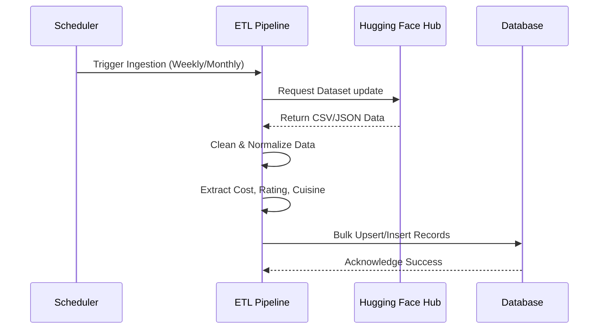
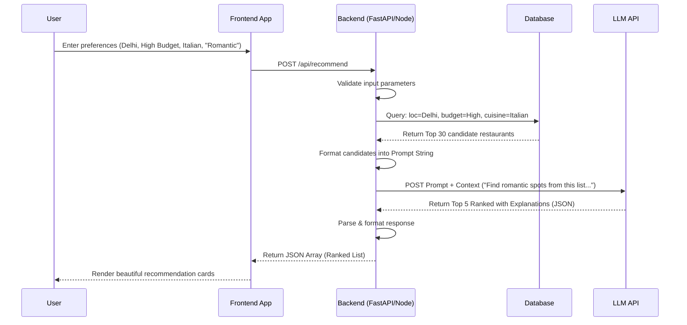

# Comprehensive Architecture: AI-Powered Restaurant Recommendation System

## 1. Executive Summary
This document outlines the detailed system architecture, component design, and data flows for an AI-Powered Restaurant Recommendation System. Inspired by Zomato, the platform dynamically matches users with restaurants by combining deterministic dataset filtering with non-deterministic, context-aware reasoning powered by a Large Language Model (LLM).

---

## 2. System Context Diagram
This diagram illustrates the high-level interactions between the system and external entities.



---

## 3. High-Level Container Architecture
The architecture follows a modern decoupled approach with a distinct Frontend, Backend API, Database, and an LLM orchestration layer.



---

## 4. Detailed Component Breakdown

### 4.1. Data Pipeline (Offline Phase)
- **Dataset Downloader:** Connects to the Hugging Face API (`ManikaSaini/zomato-restaurant-recommendation`) and pulls the raw data.
- **ETL Engine (Extract, Transform, Load):** 
  - *Cleaning*: Handles missing values, normalizes cost and rating scales.
  - *Geospatial Data*: Converts location strings into standardized representations.
  - *Categorization*: Standardizes cuisines and tags (e.g., "fast-food", "fine-dining").
- **Database:** Stores the cleaned data. A SQL database (PostgreSQL) is ideal here to allow complex querying like `WHERE location = 'X' AND cost < Y`.

### 4.2. Backend API & Integration Layer (Online Phase)
- **API Gateway:** Exposes endpoints like `POST /api/recommendations`.
- **Preference Validator:** Ensures user inputs are safe and correctly formatted.
- **Query Engine:** Transforms the user's hard constraints (Location, Budget, Minimum Rating, Specific Cuisine) into strict SQL/NoSQL queries. **Crucial Step:** This prevents sending 10,000+ restaurants to the LLM, reducing it to a candidate pool of ~20-50 highly relevant restaurants.
- **Prompt Builder:** Takes the candidate pool and injects it into a templated LLM prompt alongside the user's "soft" constraints (e.g., "looking for a quiet place for an anniversary", "good for toddlers").

### 4.3. Recommendation Engine (LLM Layer)
- **LLM Provider:** Evaluates the candidate pool against the soft constraints. 
- **Response Parser:** The LLM is instructed to output structured JSON. The parser validates the JSON, ensuring the LLM provided valid rankings and explanations for the selected top matches.

---

## 5. Architectural Flows (Sequence Diagrams)

### 5.1. Data Ingestion Flow (Asynchronous / Scheduled)


### 5.2. Recommendation Generation Flow (Synchronous)


---

## 6. Data Schema

### 6.1. Restaurant Entity (Database)
```json
{
  "restaurant_id": "string (UUID)",
  "name": "string",
  "location": {
    "city": "string",
    "neighborhood": "string"
  },
  "cuisine_tags": ["string"],
  "average_cost_for_two": "integer",
  "rating": "float",
  "votes": "integer",
  "metadata": {
    "has_online_delivery": "boolean",
    "has_table_booking": "boolean"
  }
}
```

### 6.2. LLM Output Structure (Expected)
```json
{
  "recommendations": [
    {
      "restaurant_id": "string",
      "rank": 1,
      "ai_explanation": "Perfect for a romantic evening due to its quiet ambiance and highly-rated Italian wine selection. It perfectly matches your high budget."
    }
  ]
}
```

---

## 7. Scalability & Performance Considerations
1. **Caching (Redis):** If multiple users query exactly "Delhi, Italian, Medium Budget, Family Friendly" in a short timeframe, the LLM response can be cached to save API costs and reduce latency from 3-5 seconds to <100ms.
2. **Context Window Limits:** The Backend must forcefully limit the candidate pool size (e.g., Top 20) before sending data to the LLM to prevent context overflow and reduce token consumption.
3. **Structured Generation:** Using tools like LangChain or Groq's JSON mode/structured outputs ensures the LLM returns parsable data instead of raw text, preventing frontend breaking errors.
